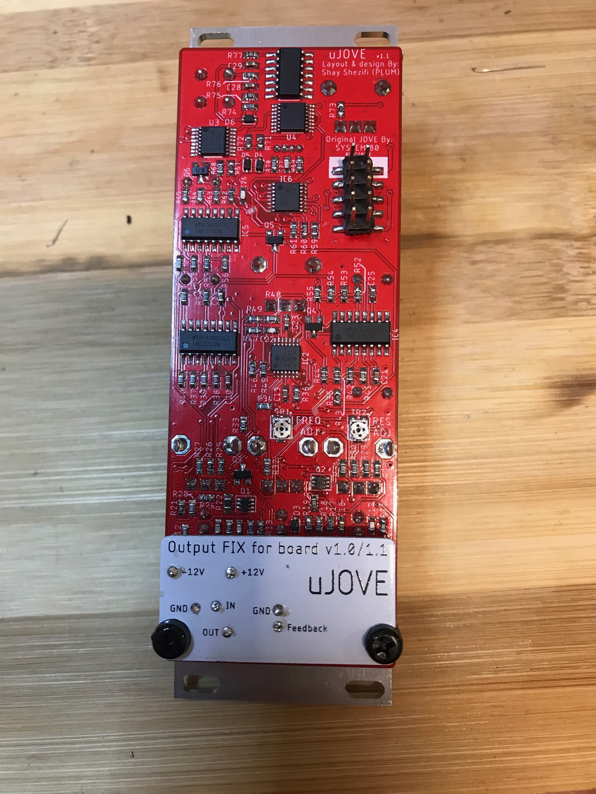

# uJOVE - FIX Board for the output of uJove v1.0/1.1 bosrds.

Installation Video: https://youtu.be/Y7jof6UY3rQ

In some cases, in uJove boards v1.0 / 1.1
there is a bleeding problem of low unfiltered signal
This problem is caused by crosstalk  between the input to the output inside IC1
uJove FIX board adds separate dedicated opamp for the output And fixes the problem

BOM:
1 uJove Output FIX for board v1.0/1.1 PCB

1 TL072 smd

2 100nF 0603 cap

7 Legs of Through Hole resistors

2 Standoffs Spacers

Installation instreactions:
1. Remove R2, R7, R8, C10 From uJove board
2. You can use those components in the FIX board
3. Cut trace from PIN 1 of IC1 and bridge PIN 1 to PIN 2
4. Use TH legs to connect between the boards.

Connection points on uJove board:
-12V from C12 TOP

+12V from C11 TOP

GND from Out/In2 jacks (GND pins)

In from R8 Bottom 

Out from R2 Bottom

Feedback from In2 jack (switch pin)

